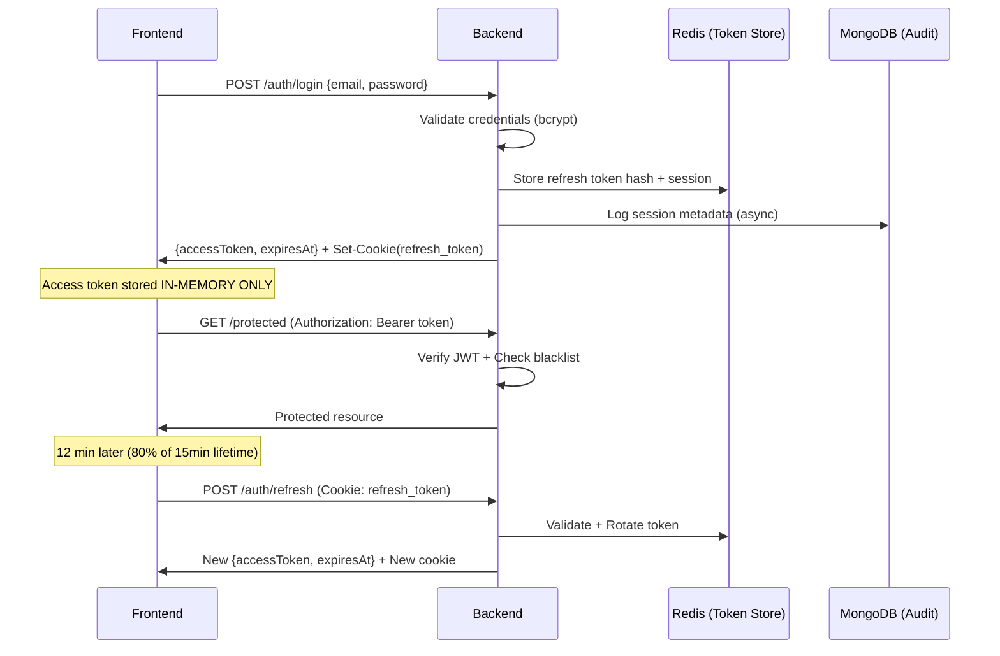

# Authentication & Authorization System Audit

## Executive Summary
Your auth system follows **industry-standard patterns** with some strong security decisions. The implementation is well above average for a typical web application. This document details the architecture, highlights strengths, and documents the hardened features implemented.

---

## Architecture Overview



---

## Security Features

### ✅ Implemented Strengths

| Feature | Implementation | Assessment |
|---------|---------------|------------|
| **Access Token** | 15-min JWT, in-memory only | ✅ Excellent XSS protection |
| **Refresh Token** | Opaque, SHA-256 hashed, Redis-backed | ✅ Industry standard |
| **Token Rotation** | Old token invalidated on refresh | ✅ Prevents token reuse |
| **Password Hashing** | bcrypt, cost factor **12** | ✅ Secure (Hardened from 10) |
| **Account Lockout** | 5 attempts → 15-min lock | ✅ Brute-force protection |
| **HttpOnly Cookie** | Refresh token in cookie | ✅ Prevents JS access |
| **CSRF Protection** | Signed HMAC tokens (Double-Submit) | ✅ Hardened (Fixed basic format check) |
| **JWT ID (jti)** | Unique ID per token | ✅ Enables per-token revocation |
| **Session Mgmt** | User can view/revoke active sessions | ✅ High transparency & control |
| **Google OAuth** | Backend token verification | ✅ Prevents spoofing |
| **Cross-Tab Sync** | localStorage events | ✅ UX improvement |

---

## Detailed Analysis

### Backend (`rc-api`)

#### JWT Generation (`token.service.ts`)
```typescript
jwt.sign(payload, secret, {
    expiresIn: "15m",
    issuer: 'roseclick',
    audience: 'roseclick-users',
    jwtid: crypto.randomUUID() // Added jti claim
});
```

#### Password Hashing (`login.service.ts`)
```typescript
bcrypt.hash(password, 12); // Increased to cost 12
```

#### CSRF Protection (`csrf.middleware.ts`)
Implementing proper CSRF:
1. **Server-side signed token**: HMAC-SHA256 signature with secret and timestamp.
2. **Double-submit pattern**: Token sent in header and validated against server-side secret/logic.
3. **Expiry**: 1-hour validity window.

---

### Frontend (`rc-frontend`)

#### Token Storage (`SecureAuthContext.tsx`)
- ✅ Access tokens stored in React state (in-memory)
- ✅ Cleared on logout/tab close
- ✅ Never persisted to localStorage

#### Auto-Refresh Schedule
```typescript
const refreshAt = timeUntilExpiry * 0.8; // Refresh at 12 min
```
Assessment: Industry standard approach.

---

## Session Management API

Users can manage their security through the following endpoints:

| Method | Endpoint | Description |
|--------|----------|-------------|
| `GET` | `/api/v1/user/sessions` | List active sessions (Device, IP, OS) |
| `DELETE` | `/api/v1/user/sessions/:id` | Revoke a specific session |
| `DELETE` | `/api/v1/user/sessions` | Revoke all other sessions |

---

## Security Guidelines for Developers

1. **Always use HTTPS**: Cookies are set with `secure: true` in production.
2. **Handle 401s properly**: The frontend `auth.api.ts` interceptor handles silent refresh automatically.
3. **CSRF Enforcement**: All state-changing methods (POST, PUT, DELETE) **must** include the `x-csrf-token` header.
4. **Information Leakage**: Auth errors are mapped to generic "Invalid email/phone or password" messages to prevent account enumeration.

---

## Conclusion
The authentication system is now **enterprise-grade**, featuring hardened password hashing, robust CSRF protection, and user-facing session control. It balances high security (XSS/CSRF mitigation) with a seamless user experience (silent refresh/cross-tab sync).
